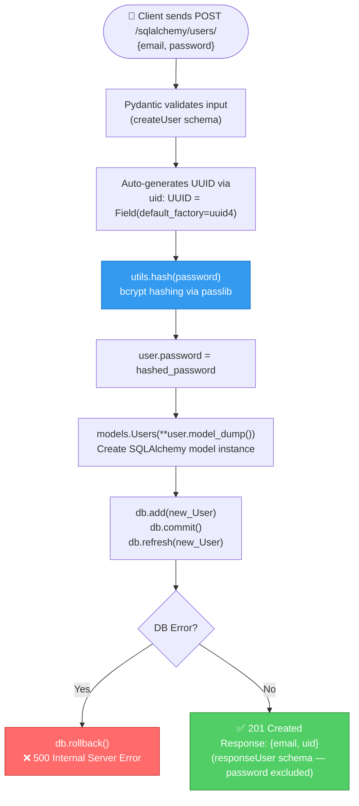
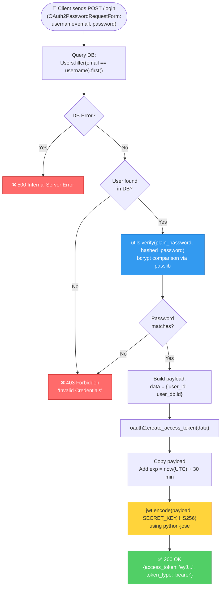
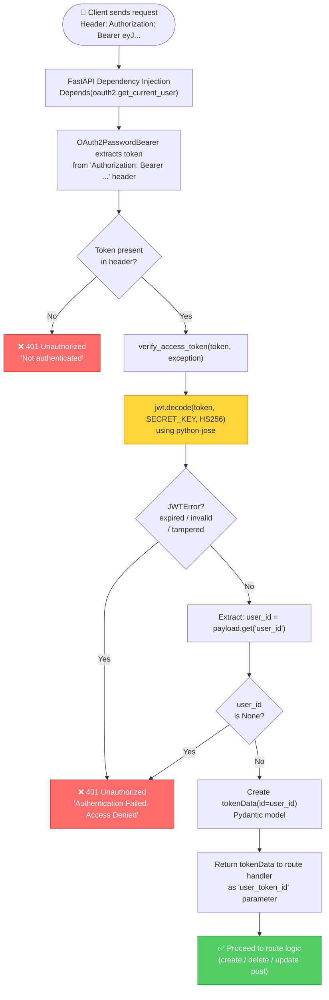
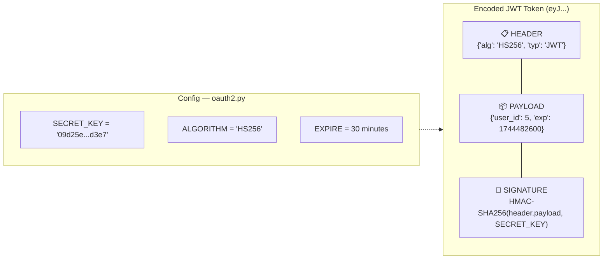
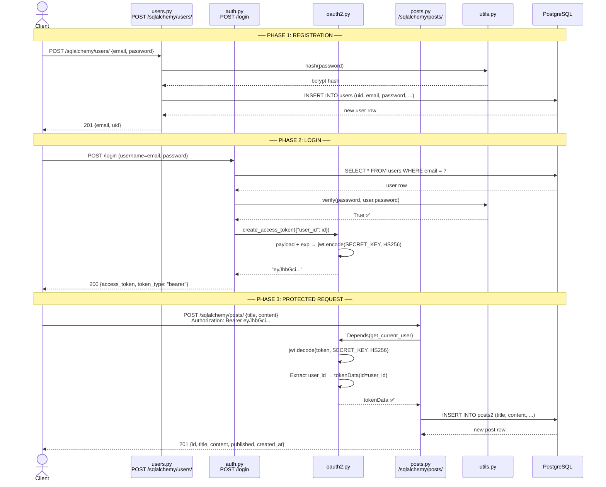

# Authentication & JWT Flow — Current Implementation

## 1. User Registration Flow

> Endpoint: `POST /sqlalchemy/users/` → [users.py](file:///home/userx/Desktop/FastAPI/freeCodeCamp/DesUno/app/routers/users.py)

### Files involved:
| Step | File | Function / Class |
|------|------|-----------------|
| Schema validation | [schemas.py](file:///home/userx/Desktop/FastAPI/freeCodeCamp/DesUno/app/schemas.py) | `createUser`, `responseUser` |
| Password hashing | [utils.py](file:///home/userx/Desktop/FastAPI/freeCodeCamp/DesUno/app/utils.py) | `hash()` using bcrypt |
| DB model | [models.py](file:///home/userx/Desktop/FastAPI/freeCodeCamp/DesUno/app/models.py) | `Users` |
| Route handler | [users.py](file:///home/userx/Desktop/FastAPI/freeCodeCamp/DesUno/app/routers/users.py) | `create_user()` |

---

## 2. Login Flow (Token Creation)

> Endpoint: `POST /login` → [auth.py](file:///home/userx/Desktop/FastAPI/freeCodeCamp/DesUno/app/routers/auth.py)

### Files involved:
| Step | File | Function / Class |
|------|------|-----------------|
| Form parsing | FastAPI built-in | `OAuth2PasswordRequestForm` |
| Route handler | [auth.py](file:///home/userx/Desktop/FastAPI/freeCodeCamp/DesUno/app/routers/auth.py) | `user_login()` |
| Password verify | [utils.py](file:///home/userx/Desktop/FastAPI/freeCodeCamp/DesUno/app/utils.py) | `verify()` |
| Token creation | [oauth2.py](file:///home/userx/Desktop/FastAPI/freeCodeCamp/DesUno/app/oauth2.py) | `create_access_token()` |
| Response schema | [schemas.py](file:///home/userx/Desktop/FastAPI/freeCodeCamp/DesUno/app/schemas.py) | `Token` |

---

## 3. Protected Route Access (Token Verification)

> Applied to: `POST`, `DELETE`, `PUT` on `/sqlalchemy/posts/` → [posts.py](file:///home/userx/Desktop/FastAPI/freeCodeCamp/DesUno/app/routers/posts.py)

### Files involved:
| Step | File | Function / Class |
|------|------|-----------------|
| Token extraction | [oauth2.py](file:///home/userx/Desktop/FastAPI/freeCodeCamp/DesUno/app/oauth2.py) | `OAuth2PasswordBearer(tokenUrl="login")` |
| Token verification | [oauth2.py](file:///home/userx/Desktop/FastAPI/freeCodeCamp/DesUno/app/oauth2.py) | `verify_access_token()` |
| Dependency injection | [oauth2.py](file:///home/userx/Desktop/FastAPI/freeCodeCamp/DesUno/app/oauth2.py) | `get_current_user()` |
| Token data schema | [schemas.py](file:///home/userx/Desktop/FastAPI/freeCodeCamp/DesUno/app/schemas.py) | `tokenData` |
| Protected routes | [posts.py](file:///home/userx/Desktop/FastAPI/freeCodeCamp/DesUno/app/routers/posts.py) | `orm_create_post`, `orm_delete_post`, `orm_update_post` |

---

## 4. JWT Token Structure

---

## 5. Complete End-to-End Sequence

---

## 6. Which Routes Are Protected?

| Route | Method | Auth Required? | Dependency |
|-------|--------|---------------|------------|
| `/sqlalchemy/users/` | POST | ❌ No | — |
| `/sqlalchemy/users/{id}` | GET | ❌ No | — |
| `/login` | POST | ❌ No | — |
| `/sqlalchemy/posts/` | GET | ❌ No | — |
| `/sqlalchemy/posts/{id}` | GET | ❌ No | — |
| `/sqlalchemy/posts/` | **POST** | ✅ **Yes** | `Depends(oauth2.get_current_user)` |
| `/sqlalchemy/posts/{id}` | **DELETE** | ✅ **Yes** | `Depends(oauth2.get_current_user)` |
| `/sqlalchemy/posts/{id}` | **PUT** | ✅ **Yes** | `Depends(oauth2.get_current_user)` |
