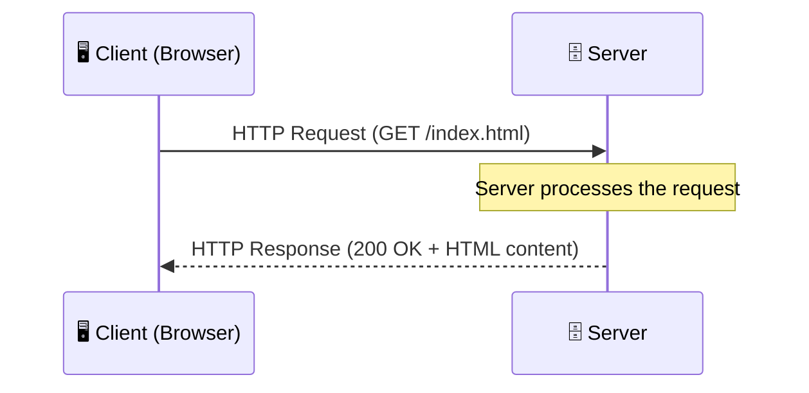
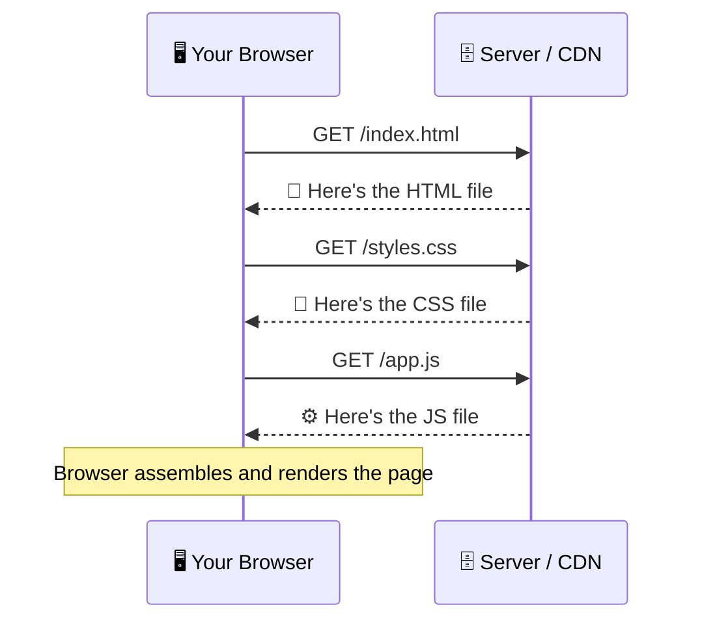
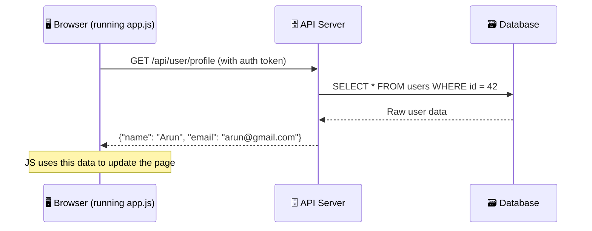
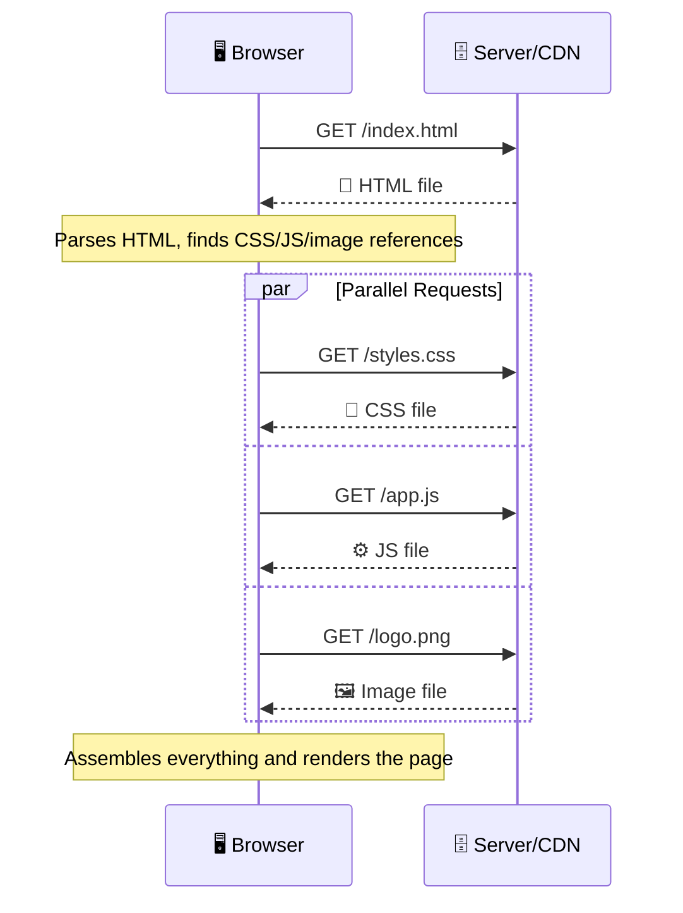
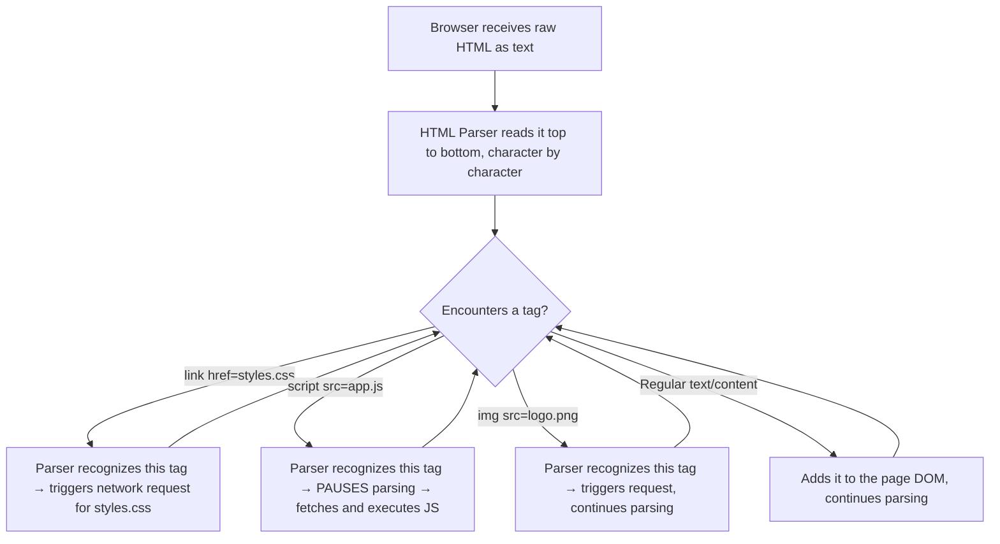

- Communication between web servers and clients
- **HTTP Requests / Response**
- Every request is completely independent
- Similar to a transactions

- **HTTPS - Hyper Text Transfer Protocol Secure**
	- Data sent is encrypted
	- **SSL / TLS - Secure Socket Layer / Transport Security Layer**
	- Install **SSL certificate** on Web Host

- **HTTP Methods**
	- **GET**
		- Retrieves data from the server
		- **Example:** - Loading HTML page / CSS Page / Images /JSON / XML / etc
		- Anytime you go to a website , it is a GET request
	- **POST**
		- Submitting Data to the server
	- **PUT**
		- Update Data from server
	- **DELETE**
		- Delete Data from sever

- **HTTP Header Fields**
	- 
	- **3 Types of Headers**
		- **General**
			- request URL
			- request method
			- status ode
			- remote address
		- **Response**
			- Server
			- Set- cookie
			- content - type
			- content - length
			- date
		- **Request**
			- cookies
			- accept 
			- content type
			- content length
			- auth
			- user agent
		

# HTTP Requests, Responses & APIs Explained

## 1. How HTTP Request & Response Work

HTTP (HyperText Transfer Protocol) is a **client-server communication protocol**. Here's the flow:



### The Request

A client (browser, app, script) sends a **request** with:

| Component | Example | Purpose |
|-----------|---------|---------|
| **Method** | `GET`, `POST`, `PUT`, `DELETE` | What action to perform |
| **URL** | `https://example.com/users` | Where to send it |
| **Headers** | `Content-Type: application/json` | Metadata about the request |
| **Body** *(optional)* | `{"name": "Alice"}` | Data payload (for POST/PUT) |

### The Response

The server processes the request and sends back a **response** with:

| Component | Example | Purpose |
|-----------|---------|---------|
| **Status Code** | `200 OK`, `404 Not Found`, `500 Error` | Did it succeed? |
| **Headers** | `Content-Type: text/html` | Metadata about the response |
| **Body** | HTML, JSON, image, etc. | The actual content |

---

## 2. HTTP Request vs API — What's the Difference?

They're **not opposites** — an API *uses* HTTP requests. Think of it as layers:

|                | HTTP Request                           | API                                                                                                 |
| -------------- | -------------------------------------- | --------------------------------------------------------------------------------------------------- |
| **What it is** | A single message sent over the network | A **contract/interface** defining *how* to communicate with a service                               |
| **Analogy**    | A single phone call                    | The phone directory + rules for how to call                                                         |
| **Scope**      | One request → one response             | A collection of endpoints, rules, authentication, and data formats                                  |
| **Example**    | `GET /users/42`                        | The entire system: `GET /users`, `POST /users`, `DELETE /users/:id`, auth tokens, rate limits, etc. |

> [!NOTE]
> **In short:** An HTTP request is the *vehicle*. An API is the *road system* — it defines what routes exist, what you can send, and what you'll get back.

---

## 3. HTTP Request Loading Content vs API Sending Details

This is the key practical distinction:

### HTTP Request → Loading Content (Browser/Client)

When you type `https://google.com` in your browser:

```
GET / HTTP/1.1
Host: google.com
```

- The server returns **HTML, CSS, JS, images** — things meant to be **rendered visually**
- The browser **displays a webpage** for a human to see
- The response is **presentation-focused**

### API Request → Sending/Receiving Data

When an app calls `https://api.weather.com/forecast?city=Mumbai`:

```
GET /forecast?city=Mumbai HTTP/1.1
Host: api.weather.com
Authorization: Bearer abc123
```

- The server returns **structured data** (usually JSON):

```json
{
  "city": "Mumbai",
  "temp": 32,
  "condition": "Sunny"
}
```

- The data is meant to be **consumed by code**, not directly by a human
- The response is **data-focused** — the app decides how to display it

### Summary Table

| Aspect | Loading Content (Browser) | API Data Exchange |
|--------|--------------------------|-------------------|
| **Consumer** | Human (via browser) | Application/Code |
| **Response format** | HTML, CSS, JS, images | JSON, XML |
| **Purpose** | Display a visual page | Transfer raw data |
| **Who renders?** | Server builds the page | Client app builds the UI from data |
| **Example** | Visiting `amazon.com` | Amazon's mobile app fetching product prices |

> [!IMPORTANT]
> **The underlying mechanism is the same** — both use HTTP requests and responses. The difference is **what's being sent** and **who's consuming it**.

---

# Frontend Files vs API Responses

## Frontend Files (HTML, CSS, JS) — YES, They Sit in a Folder

When you visit `https://google.com`, the server literally has files like:

```
Google's Server (or CDN)/
├── index.html        ← sits in a folder, gets sent to you
├── styles.css        ← sits in a folder, gets sent to you
├── app.js            ← sits in a folder, gets sent to you
└── logo.png          ← sits in a folder, gets sent to you
```



These are **static files** — they don't change per user. Everyone gets the **same** `index.html`. The server just picks them up from a folder and sends them.

---

## API Data (JSON) — These Are Generated Dynamically

Once those frontend files load in your browser, the **JavaScript inside `app.js`** makes **API calls** to get personalized data:



This JSON is **built fresh** by server code — no JSON file sits in a folder.

---

## The Full Picture — Both Happen Together

```mermaid
flowchart TB
    subgraph Step1["Step 1: Load the Frontend - Static Files"]
        A[Browser requests google.com] --> B[Server sends HTML/CSS/JS from a folder]
        B --> C[Browser renders the page shell]
    end

    subgraph Step2["Step 2: Fetch Data - API Calls"]
        C --> D[JavaScript runs and calls APIs]
        D --> E[API server queries database]
        E --> F[Server builds JSON response dynamically]
        F --> G[Browser fills page with real data]
    end

    style Step1 fill:#1a3a2a,stroke:#4ade80
    style Step2 fill:#1a2a3a,stroke:#60a5fa
```



---

## Real World Example — Instagram

1. **Step 1 (Static Files — sitting in a folder):** Your browser downloads Instagram's `index.html`, `app.js`, `styles.css` → shows the layout/skeleton
2. **Step 2 (API Calls — NOT files in a folder):** The JavaScript calls `GET /api/feed` → the server queries a database for YOUR specific posts → builds JSON → sends it back → JS renders the photos on your screen

---

## Summary

| Aspect                   | Frontend Files (HTML/CSS/JS) | API Data (JSON)              |
| ------------------------ | ---------------------------- | ---------------------------- |
| **Sits in a folder?**    | ✅ Yes                        | ❌ No                         |
| **Same for everyone?**   | ✅ Yes (usually)              | ❌ No (personalized)          |
| **How it's served**      | Picked up from disk / CDN    | Generated by code + database |
| **Changes per request?** | No                           | Yes                          |

> [!IMPORTANT]
> Frontend files **are** just files on a server being handed to you. The **data** those files then request via API calls is the part that's generated dynamically from a database.


# Multiple HTTP GET Requests — How a Page Loads

## The Browser's Waterfall Process

### Step 1 — Browser sends the first GET request

```
GET / HTTP/1.1
Host: google.com
```

Server responds with **just the HTML file**:

```html
<!DOCTYPE html>
<html>
<head>
    <link rel="stylesheet" href="styles.css">   <!-- browser sees this -->
    <script src="app.js"></script>                <!-- browser sees this -->
</head>
<body>
                              <!-- browser sees this -->
</body>
</html>
```

### Step 2 — Browser parses the HTML and discovers dependencies

It finds references to `styles.css`, `app.js`, and `logo.png` — and fires off **separate GET requests** for each:

```
GET /styles.css HTTP/1.1    ← Request #2
GET /app.js HTTP/1.1        ← Request #3
GET /logo.png HTTP/1.1      ← Request #4
```

### The Full Timeline



> [!NOTE]
> The browser sends follow-up requests **in parallel** (not one after another) to speed things up. Modern browsers can send **6+ requests simultaneously** to the same server.

---

## See It Yourself — Browser DevTools

Open any website → Press `F12` → Go to the **Network** tab. You'll see every single GET request listed:

| # | Method | File | Size | Time |
|---|--------|------|------|------|
| 1 | GET | `index.html` | 12 KB | 50ms |
| 2 | GET | `styles.css` | 8 KB | 30ms |
| 3 | GET | `app.js` | 45 KB | 60ms |
| 4 | GET | `logo.png` | 20 KB | 40ms |
| 5 | GET | `font.woff2` | 15 KB | 35ms |

> [!TIP]
> A typical webpage makes **30–100+ separate HTTP requests** just to load all its files (CSS, JS, fonts, images, tracking scripts, etc.).

---

## Why Not Send Everything in One Request?

| Reason                  | Explanation                                                                                                                              |
| ----------------------- | ---------------------------------------------------------------------------------------------------------------------------------------- |
| **Caching**             | If `styles.css` hasn't changed, the browser uses its cached copy and skips the request entirely                                          |
| **Parallelism**         | Multiple small requests in parallel is faster than waiting for one giant response                                                        |
| **Different servers**   | Images might come from a CDN, fonts from Google Fonts, analytics from another server — each is a different request to a different server |
| **HTTP/2 multiplexing** | Modern HTTP/2 sends all requests over a **single connection** simultaneously, so the overhead is minimal                                 |
# How the Browser Parses HTML for Dependencies

## It's a Two-Part System

The browser has a **built-in HTML parser** (hardcoded into its source code), and the HTML tags provide the **instructions** for what to fetch. Both are needed.

> [!NOTE]
> Think of HTML as a **recipe** and the browser as a **chef**.
> - The recipe says "add 2 eggs" — but it doesn't know how to crack eggs
> - The chef knows how to crack eggs — but doesn't know how many to add
> - **Both are needed.** The recipe provides instructions, the chef provides the skills to execute them.

---

## The Browser's Hard coded Rules

Every browser (Chrome, Firefox, Safari) ships with an HTML parser that has these rules built in:

| When it encounters... | It knows to... |
|---|---|
| `<link rel="stylesheet" href="...">` | Fetch that CSS file |
| `<script src="...">` | Fetch and run that JS file |
| `` | Fetch that image |
| `<video src="...">` | Fetch that video |
| `<link rel="icon" href="...">` | Fetch the favicon |
| `@import url("...")` inside CSS | Fetch another CSS file |
| `url(...)` inside CSS | Fetch that font/image |

---

## The Parsing Process — Step by Step



---

## Blocking vs Non-Blocking Behaviour

Different tags behave differently when the parser encounters them:

| Behaviour | Why |
|---|---|
| `<script>` **blocks parsing** | JS might modify the HTML, so the browser pauses and waits for the script to download + execute before continuing |
| `<script defer>` or `<script async>` | Developer tells the browser "don't block, keep parsing" |
| `` **does NOT block** | Images are visual; the page structure doesn't depend on them |
| `<link rel="stylesheet">` **blocks rendering** (not parsing) | The browser won't paint the page until CSS is ready, to avoid a flash of unstyled content |

> [!IMPORTANT]
> This is why you often see `<script>` tags at the **bottom** of the HTML body or with `defer` — it lets the browser parse the full page first before running JavaScript.

---

## Who Decides What Gets Fetched?

| Question                                                               | Answer                                                               |
| ---------------------------------------------------------------------- | -------------------------------------------------------------------- |
| **Who decides WHICH files to load?**                                   | The **developer** — by writing tags in HTML                          |
| **Who knows HOW to read those tags?**                                  | The **browser** — it's programmed with an HTML parser                |
| **Can the browser fetch files NOT in the HTML?**                       | No (except things like favicon auto-detection)                       |
| **Can the HTML load files without the browser understanding the tag?** | No — if you invent `<myfile src="data.txt">`, the browser ignores it |

> [!TIP]
> **HTML provides the "what"** (which files to get). **The browser provides the "how"** (knowing that those tags mean "go fetch this"). Both are needed — neither works alone.
